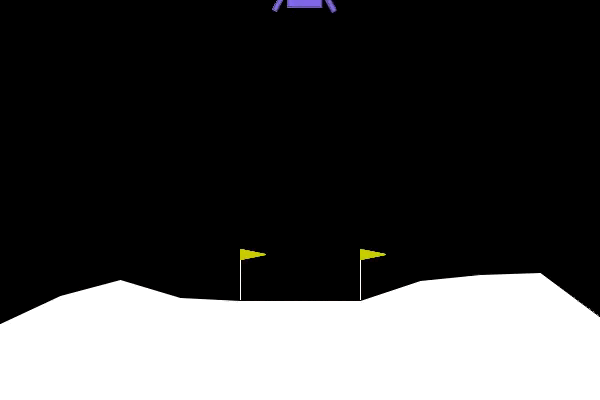
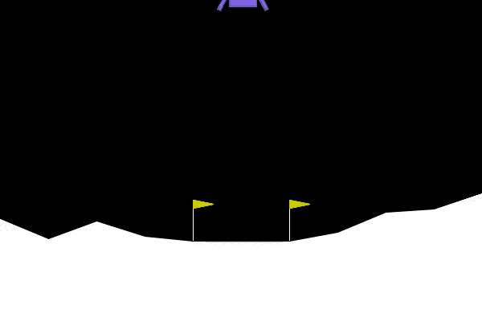
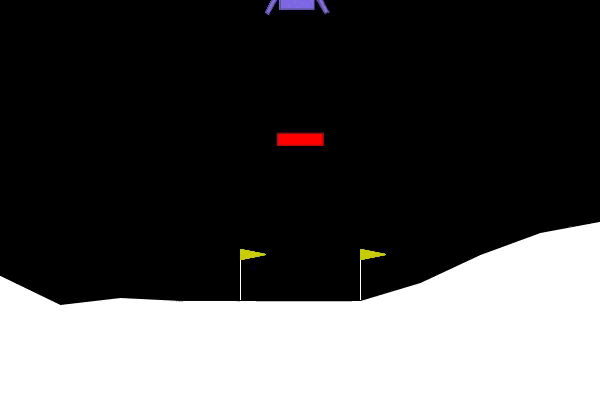
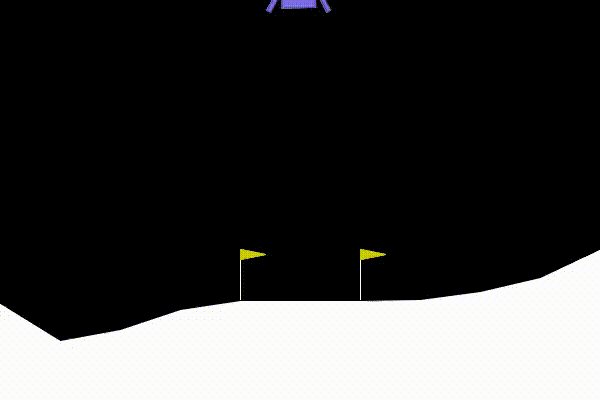
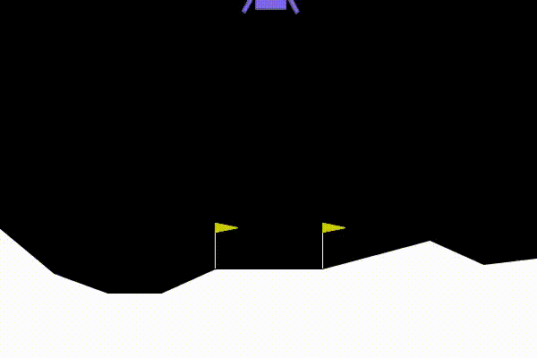
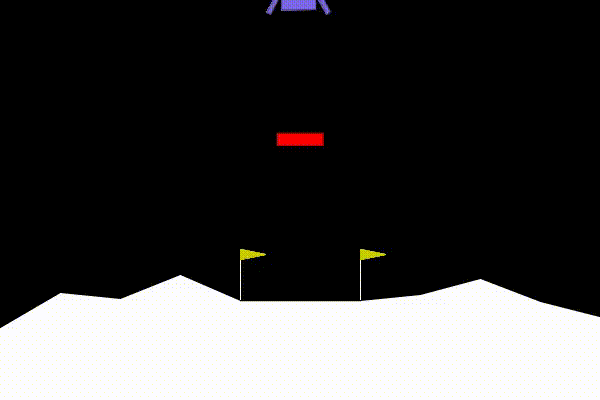
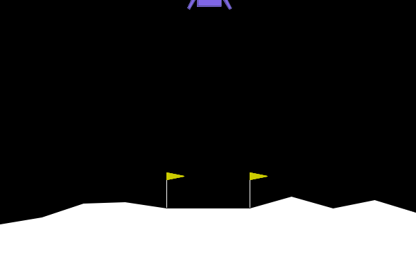
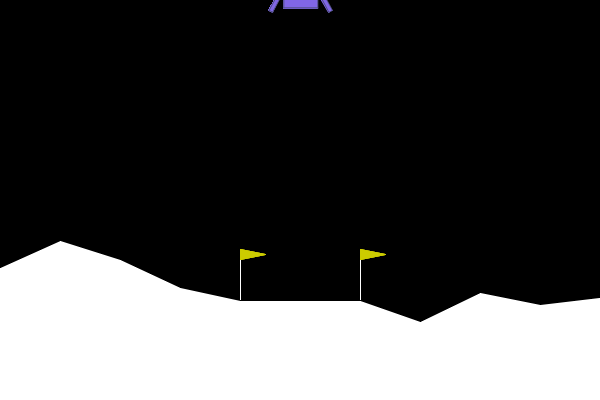
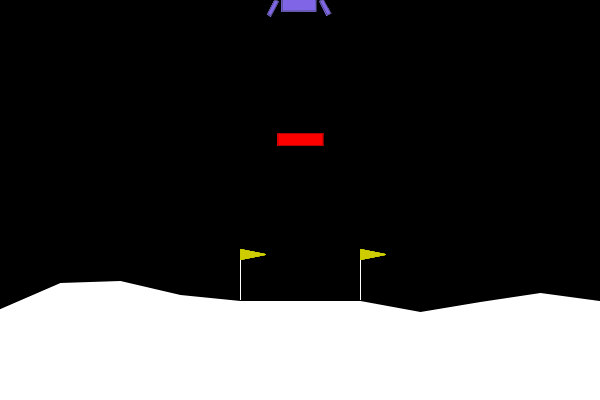

## Lunar Lander 
The Lunar Lander environment simulates the scenario of landing an autonomous spacecraft on the moon. The goal is for the agent to control the lander and safely land it on a landing pad located at coordinates (0,0). The lander starts at the top of the screen with a random initial position and velocity. The agent controls the lander by firing the thrusters, which influence its horizontal and vertical velocity.

## Tested Scenarios
we used three scenarios in our work to test the algorithm:
1. **The Default Lunar Lander Environment**: we tested all the algorithms on the default lunar lander environment from the gym library.

2. **Modified Reward**: we modified reward function for the lunar to get better performance. We increased the penalty on the position and decreased it on the velocity in order to make the lander land faster, also we added a penalty when the reward is less than -400 to prevent the lander form unnecessary hovering over the landing spot and to land faster. Also we increased the reward for each leg contact with land to 20. 

3. **Adding Obstacle into The Environment**:
We added a rectangle static obstacle in the way of the lander and the lander will crash and lose the game if it collided with obstacle and get a penalty of -100. The propose of adding this obstacle is to see if the lander will manage to avoid colliding with obstacle during the landing.

## Results 
### DQN:
1. **The Default Lunar Lander Environment**: 

2. **Modified Reward**: 

3. **Obstacle Addition**:

---
---

### DDQN:
1. **The Default Lunar Lander Environment**: 

2. **Modified Reward**: 

3. **Obstacle Addition**:

---
---

### SAC:
1. **The Default Lunar Lander Environment**: 

2. **Modified Reward**: 

3. **Obstacle Addition**:

